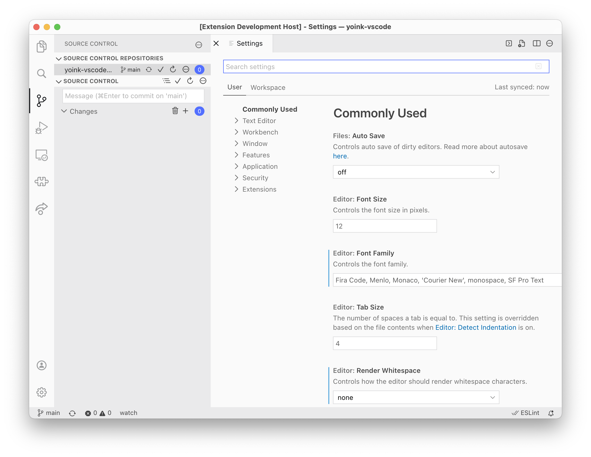

# SF Symbols Icon Theme

This theme uses [Apple’s SF Symbols](https://developer.apple.com/sf-symbols/) icon set to provide many icons for VS Code. I plan to update it as new icons become available, and would appreciate feedback on icon choices!

## Installing

Note: for legal reasons, this theme cannot actually package the SF Symbols. Therefore, you need to complete a few extra steps before you can use the theme:

1. [Download the SF Pro font](https://developer.apple.com/fonts/) from Apple’s website and install it. The system fonts that come with macOS do not include the necessary SF Symbols as far as I know.
2. After installing the theme and its monkey patch dependency, you will be prompted to restart VS Code. Do this.
3. You may also need to reload the window once to make sure the code that swaps in the actual SF Pro font gets a chance to run.

Once you’ve followed those steps, open the command pallete, choose “Preferences: Product Icon Theme,” then select “SF Symbol Icons.”

## Changelog

### v2.2.0

**New**: Added a file icon theme! Set your File Icon Theme to SF Symbol Icons and reload the window to use it. 
Also: tweaked the code that modifies the CSS used to deliver the theme.

### v2.1.1

Fix font & injection on recent VS Code Insiders builds. 
Also: checked the new icons in SF Symbols 3.1 and decided not to add any of them.

### v2.1.0

Added a dirty close icon for files

### v2.0.2

Fixed issues with breakpoint and and array symbols

### v2.0.1

Added missing changelog entries

### v2.0.0

Updated to depend on the [SF Symbols 3 Beta](https://devimages-cdn.apple.com/design/resources/download/SF-Symbols-3.dmg)

### v1.1.1

Fixed a bug in the release process

### v1.1.0

Added and updated a variety of icons

### v1.0.0

_Initial release_
